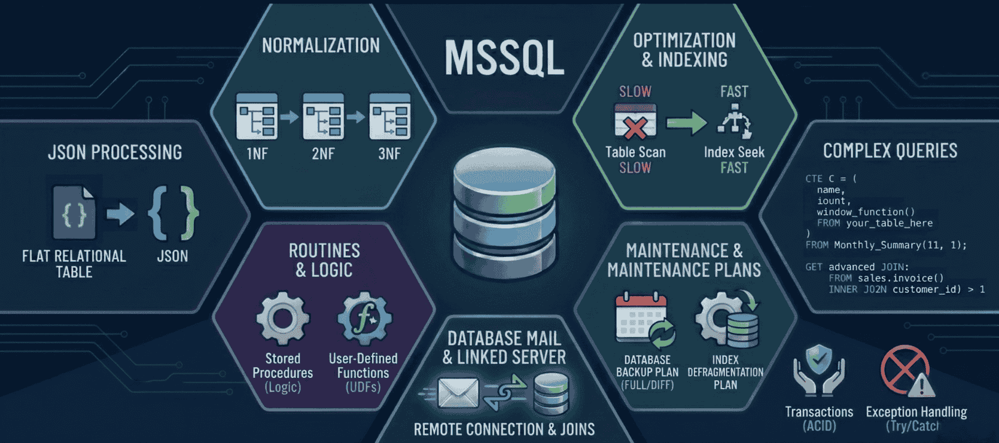

## 🚀 Database Engineering Ecosystem


This repository is a comprehensive demonstration of full-lifecycle Microsoft SQL Server (MSSQL) expertise, ranging from structural database design to complex administrative operations.

The infographic above visualizes the core technical domains covered in this portfolio. Each section of the diagram corresponds to specific SQL scripts, stored procedures, and migration files found within this repository.

### 🏗️ 1. Architecture & Design

* **Normalization (1NF, 2NF, 3NF):** The foundational schema design demonstrating how to reduce data redundancy and enforce data integrity through progressive normalization steps.
* **JSON Processing:** Modernizing relational data by handling semi-structured data. This includes parsing API responses and converting multi-nested JSON structures into flat relational tables.

### 🔧 2. Performance & Advanced Querying

* **Advanced Querying & Diagnostics:** Scripts showcasing CTEs, complex JOIN logic, pivot queries, functions, and real-time deadlock management queries using system dynamic management views (DMVs).
* **Optimization & Indexing:** A practical approach to performance tuning, demonstrating the conversion of costly "Table Scans" to highly efficient "Index Seeks."
* **Routines & Logic:** Implementation of complex business logic using optimized Stored Procedures and User-Defined Functions (UDFs).

### ⚙️ 3. Operations & Infrastructure

* **Maintenance Plans:** Fully automated database maintenance strategies, including scheduled full and differential database backups and intelligent index defragmentation plans based on fragmentation thresholds.
* **Deadlock Management:** A proactive approach to database health. This section includes automated deadlock graph analysis and targeted queries to identify, recover from, and prevent database locking issues.
* **Database Mail & Linked Servers:** Infrastructure code demonstrating remote instance connections, distributed JOIN queries, and integrated automated alerting for system errors.


## SQL Query - Sample Collectios

 
<details open>
<summary><b>Stored procedure 1</b></summary>

<br>

```sql
-- =============================================
-- Author:       Shamon
-- Description:  Retrieves overall summary counts by file status with optimized filtering.
-- =============================================
ALTER PROCEDURE [dbo].[sp_PL_Overall_Summary]  
(
    @From             DATE,
    @To               DATE,
    @IDDepartment     INT,
    @IDClient_List    VARCHAR(100),
    @DateCategory     INT,
    @IDFileSource_List VARCHAR(100),
    @IDUser_SDM       INT
)
AS  
BEGIN  
    SET NOCOUNT ON;

    -- 1. Setup Filter Variables (Handling multi-select inputs)
    DECLARE @ClientFilter TABLE (ID INT PRIMARY KEY);
    IF @IDClient_List <> '-1' 
        INSERT INTO @ClientFilter SELECT tuple FROM dbo.fn_split_string(@IDClient_List, ',');

    -- SARGable date boundary calculation
    DECLARE @DateToPlus1 DATE = DATEADD(DAY, 1, @To);

    -- 2. Aggregate Data into Temp Storage
    CREATE TABLE #StatusCounts (TotalCount INT, IDFileStatus INT);

    INSERT INTO #StatusCounts (TotalCount, IDFileStatus)
    SELECT COUNT(PL.IDPaymentLog), PL.IDFileStatus
    FROM PL_PaymentLog PL WITH(NOLOCK)
    INNER JOIN Client C ON C.IDClient = PL.IDClient
    WHERE (@IDDepartment = -1 OR C.IDDepartment = @IDDepartment)
      AND (@IDClient_List = '-1' OR PL.IDClient IN (SELECT ID FROM @ClientFilter))
      AND (
          (@DateCategory = 1 AND PL.PostedDate >= @From AND PL.PostedDate < @DateToPlus1) OR
          (@DateCategory = 2 AND PL.DepositDate >= @From AND PL.DepositDate < @DateToPlus1)
          -- ... additional date logic
      )
    GROUP BY PL.IDFileStatus;

    -- 3. Pivot Result Set for Dashboard UI
    SELECT 
        ISNULL([0], 0)  AS TotalCount,
        ISNULL([1], 0)  AS Unallocated,
        ISNULL([6], 0)  AS Completed,
        ISNULL([12], 0) AS Duplicate
    FROM 
    (
        SELECT TotalCount, IDFileStatus FROM #StatusCounts
        UNION ALL
        SELECT SUM(TotalCount), 0 FROM #StatusCounts -- Grand Total
    ) AS SourceTable
    PIVOT (SUM(TotalCount) FOR IDFileStatus IN ([0],[1],[2],[6],[12])) AS PivotTable;

    DROP TABLE #StatusCounts;
END
 ```  
</details>  

<details open>
<summary><b>Stored procedure 2</b></summary>

<br>
 
```sql
/* =============================================
   Author:       Shamon
   Description:  Retrieves overall quality summary metrics 
                 grouped by Client, including Process and 
                 User error weightage scores.
   ============================================= */
ALTER PROCEDURE [dbo].[sp_ARMS_OverallSummary_Quality]
(
    @IDDepartment     INT,
    @IDClient_List    VARCHAR(100),
    @IDAllocatedTo    INT,
    @From             DATE,
    @To               DATE
)
AS
BEGIN
    SET NOCOUNT ON;

    -- 1. Parameter Initialization (Localized for query optimization)
    DECLARE @IDDepartment_Param    INT          = @IDDepartment,
            @IDClient_List_Param   VARCHAR(100) = @IDClient_List;

    -- Table variable for high-performance join filtering
    DECLARE @ClientFilter TABLE (ID INT PRIMARY KEY);
    IF @IDClient_List_Param <> '-1'
    BEGIN
        INSERT INTO @ClientFilter (ID)
        SELECT CAST(tuple AS INT) FROM dbo.fn_split_string(@IDClient_List_Param, ',');
    END

    -- 2. CTE Pipeline: Unified Metrics Aggregation
    ;WITH CTE_BaseTable AS (
        SELECT 
            CM.IDClient,
            CA.IDClaimAction,
            CASE WHEN ACS.IDClaimAction IS NOT NULL THEN 1 ELSE 0 END AS IsSampled
        FROM ARMS_ClaimMaster CM WITH(NOLOCK)
        INNER JOIN ARMS_ClaimAction CA WITH(NOLOCK) ON CA.IDClaimMaster = CM.IDClaimMaster
        INNER JOIN Client CL WITH(NOLOCK) ON CL.IDClient = CM.IDClient 
        LEFT JOIN ARMS_AuditCalculationSummary ACS WITH(NOLOCK) ON ACS.IDClaimAction = CA.IDClaimAction
        WHERE (@IDClient_List_Param = '-1' OR CM.IDClient IN (SELECT ID FROM @ClientFilter))
          AND (CA.ProductionDate BETWEEN @From AND @To)
    ),
    CTE_Metrics AS (
        SELECT 
            B.IDClient,
            -- Calculate Process vs User Weightage Scores
            SUM(CASE WHEN AEM.Level = 2 THEN ETM.Weightage ELSE 0 END) AS ErrWeight_Process,
            SUM(CASE WHEN AEM.Level = 1 THEN ETM.Weightage ELSE 0 END) AS ErrWeight_User,
            COUNT(DISTINCT B.IDClaimAction) AS TotalCount,
            SUM(B.IsSampled) AS SamplingCount
        FROM CTE_BaseTable B
        LEFT JOIN ARMS_AuditError_Reported ER WITH(NOLOCK) ON ER.IDClaimAction = B.IDClaimAction
        LEFT JOIN ARMS_AuditErrorMaster AEM WITH(NOLOCK) ON (AEM.IDAuditErrorMaster = ER.IDAuditErrorMaster)
        LEFT JOIN ARMS_ErrorTypeMaster ETM WITH(NOLOCK) ON ETM.IDErrorType = AEM.IDErrorType
        GROUP BY B.IDClient
    )

    -- 3. Final Result Projection with Weighted Score Calculations
    SELECT 
        C.ClientName,
        CAST(ISNULL((M.OppWeight_Process - M.ErrWeight_Process) * 100.0 / NULLIF(M.OppWeight_Process, 0), 0) AS DECIMAL(16,2)) AS Score_Process,
        CAST(ISNULL((M.OppWeight_User - M.ErrWeight_User) * 100.0 / NULLIF(M.OppWeight_User, 0), 0) AS DECIMAL(16,2)) AS Score_User,
        ISNULL(M.TotalCount, 0) AS TotalCount,
        ISNULL(M.SamplingCount, 0) AS SamplingCount
    FROM Client C WITH(NOLOCK)
    LEFT JOIN CTE_Metrics M ON C.IDClient = M.IDClient
    WHERE ISNULL(C.IsActive, 1) = 1
    ORDER BY C.ClientName;

END
 ```  
</details>  
